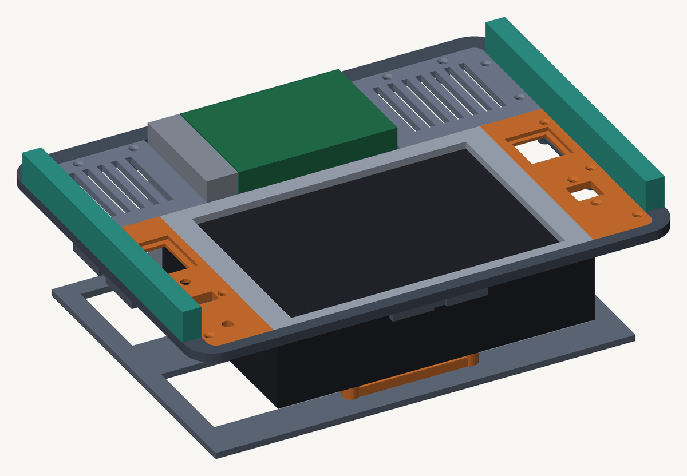
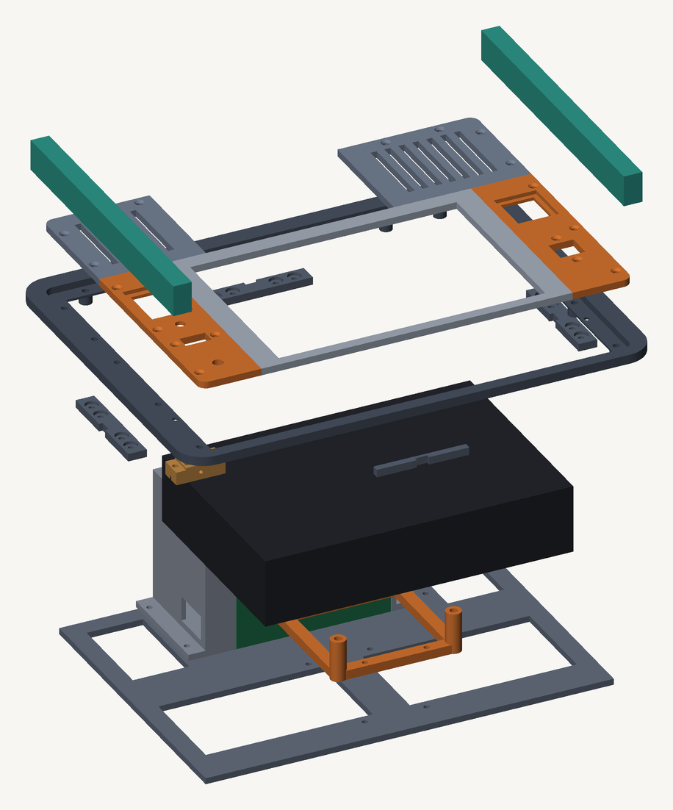
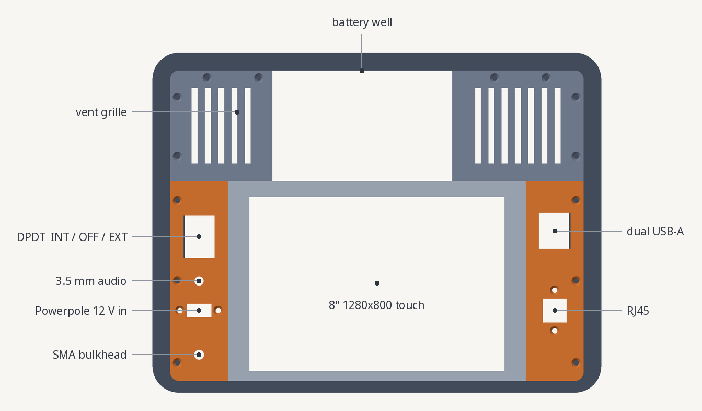

# cyberdeck




A Raspberry Pi 5 in a Pelican 1400, running niri: 1280×800 touchscreen, wired USB
keyboard, no mouse, 512 GB NVMe, 193 GB of offline reference material, and a ham radio
stack. Built to work with no network and no mains.

It's finished and it runs. Full 2.4 GHz sustained with the case closed, ~74 °C under
load, ~6 hours on the internal LiFePO4 pack.

Two halves to this repo:

- The software is additive provisioning for Raspberry Pi OS, scripts and configs
  that add niri alongside the stock desktop without touching it. That's most of what
  follows, plus [DESIGN.md](DESIGN.md) for the reasoning.
- The enclosure is OpenSCAD, in [docs/design/](docs/design/), with the design
  decisions in [docs/CASE.md](docs/CASE.md). Fifteen printed parts, no holes drilled in
  the shell.

## This is additive. It is not a reinstall.

Nothing here reformats, reinstalls, or replaces Raspberry Pi OS.

- labwc stays installed and stays the default session. niri is added *alongside* it
  in the lightdm session menu. Pick at the login screen.
- Everything built from source installs under `/usr/local`, which no distro package
  owns. `apt` stays consistent.
- `apt` steps only ever add packages. Nothing is removed or replaced.
- Configs are symlinked into `~/.config/{niri,waybar,foot,mako}`, all new directories,
  plus the single file `~/.config/qutebrowser/config.py`. That one is a file link and
  not a directory link on purpose: qutebrowser keeps its own bookmarks and quickmarks
  in that directory and they are left exactly where they are.
  `~/.config/labwc` and `~/.config/wf-panel-pi` are never touched.
- Your ZIMs, `~/.config/WSJT-X.ini`, gqrx, gnuradio, and pat configs are untouched.

Rollback is: log out, choose labwc. You're exactly where you started.

## Usage

```sh
bin/provision.sh        # build + install everything (idempotent, re-runnable)
bin/deploy-config.sh    # symlink configs into ~/.config
```

There's no session menu on this machine. Raspberry Pi OS ships autologin, so it
boots straight into whatever `autologin-session` says. To get into niri, in increasing
order of commitment:

```sh
niri                              # 1. nested inside labwc, zero-risk smoke test
                                  # 2. Ctrl+Alt+F2, log in, run: niri-session
bin/90-set-session.sh niri        # 3. make it the boot default
bin/90-set-session.sh labwc       #    ...and back again
```

Recovery if niri fails at boot: ssh in, or Ctrl+Alt+F1..F6, then
`bin/90-set-session.sh labwc && sudo systemctl restart lightdm`.

Individual steps, if you'd rather go one at a time:

| Script | What it does |
|---|---|
| `bin/00-packages.sh` | apt: the whole niri ecosystem + all three build toolchains |
| `bin/10-build-niri.sh` | niri `v26.04` from source (needs rustup, see below) |
| `bin/20-build-xwayland-satellite.sh` | X11 bridge `v0.8.2`, builds with Debian's rustc |
| `bin/30-build-mshv.sh` | MSHV FT8/FT4, pinned commit, `MSHV_Slarm64_PI.pro` |
| `bin/40-install-claude-code.sh` | Claude Code under `~/.local/share/claude` |
| `bin/50-doomsday-extras.sh` | tiered offline extras, run bare to list the tiers |
| `bin/51-fetch-content.sh` | fetch ZIMs, register them in the kiwix library |
| `bin/52-kiwix-serve.sh` | `kiwix-serve` unit on `127.0.0.1:8080` (read in qutebrowser) |
| `bin/53-radio-data.sh` | ham reference data, `cty.dat` and friends |
| `bin/54-maps.sh` | TIGER shapefiles for Xastir + an offline-built Garmin `.img` |
| `bin/55-fetch-computing.sh` | computing/reference ZIM tier |
| `bin/56-flipper.sh` | qflipper + clone the existing flipper repo onto the deck |
| `bin/57-gps-time.sh` | QLG2 GPS on the GPIO header: UART, 1PPS, gpsd, chrony (DESIGN §9) |
| `bin/58-landing-page.sh` | the launcher page on `127.0.0.1:8000`: every local resource, tappable |
| `bin/59-touch-input.sh` | wvkbd on-screen keyboard + lisgd touchscreen gestures |
| `bin/60-local-ai.sh` | `llama-server` on `127.0.0.1` + `files/ai/ask-local.py` |
| `bin/70-thermal-tune.sh` | `measure [secs]`, sustained-load thermal profile |
| `bin/80-check-boot-integrity.sh` | run after ANY disk/clone change |
| `bin/90-set-session.sh` | flip the boot session between `niri` and `labwc` |
| `bin/91-tidy-units.sh` | trim units that only make sense under the Pi desktop |
| `bin/deploy-config.sh` | symlink configs into `~/.config` |
| `bin/sync-to-pi.sh` | push this repo to the deck, validate the KDL, live-reload |
| `bin/verify-post-reboot.sh` | run after any kernel change |

## The three from-source builds, and why

Raspberry Pi OS trixie packages the *entire* niri ecosystem (foot, fuzzel, waybar,
swaybg, mako, cliphist, gtklock, seatd, xwayland) but not niri itself. Checked
2026-08-31 against trixie, trixie-updates, trixie-backports (temporarily enabled to
look) and archive.raspberrypi.com. It missed the trixie freeze. Same story for
`xwayland-satellite` and MSHV.

The Rust trap: trixie ships rustc/cargo 1.85. niri v26.04 declares
`rust-version = "1.87"`, so the distro toolchain is too old and fails with a confusing
error rather than a clean MSRV message. That's the only reason `10-build-niri.sh`
installs rustup. `xwayland-satellite` v0.8.2 pins exactly 1.85.0 and builds fine with
Debian's own toolchain.

## Optional extras

```sh
bin/50-doomsday-extras.sh          # list the tiers
bin/50-doomsday-extras.sh time     # start here, see docs/CONTENT.md
```

## Editing config after deployment

`deploy-config.sh` symlinks `~/.config/{niri,waybar,foot,mako}` into the repo checkout on
the Pi, which is a copy of this one. Edit here, then:

```sh
bin/sync-to-pi.sh    # rsync across, validate the KDL, live-reload niri
```

## Health checks

```sh
bin/80-check-boot-integrity.sh   # run after ANY disk/clone change
bin/verify-post-reboot.sh        # run after any kernel change
bin/70-thermal-tune.sh measure   # 5-min sustained-load thermal profile
```

## The enclosure

The computer is a JUNEBOX 8" module, the Pi 5, the NVMe and the heatsink all live inside
the display's backboard enclosure, which takes 12 V in and mounts on VESA 75. So the
build is three objects (module, keyboard, battery) behind a printed faceplate.

The faceplate rides the Pelican's twelve moulded ribs at 75 mm, held by nothing but the
case walls and two TPU preload strips. Nothing is drilled, bonded or fastened to the
shell, so it's still a waterproof box when it's shut.

```sh
docs/design/build.sh              # every part to STL
docs/design/check-stl.py *.stl    # bbox, bed fit, z=0, solids, facet count
docs/design/check-all-pairs.sh    # each part against the union of all others
docs/design/features.py x.stl 0.5 # what's actually in a finished STL

docs/design/export-parts.sh       # then: build/venv/bin/python docs/design/render.py
```

The renders on this page come out of `render.py`, which reads the same placements
`assembly.scad` uses for its interference checks, so a picture here can't quietly
disagree with the thing that was verified. (It rasterises in software: OpenSCAD's own
PNG export wants an offscreen GL context, which a headless box doesn't have.)





Read [docs/CASE.md](docs/CASE.md) for the design, and
[docs/LESSONS.md](docs/LESSONS.md) for the eight faults that were worth writing down
(every one of them was found by looking at something, not by an assertion, which is
itself the lesson).

## Read next

- [DESIGN.md](DESIGN.md): the software reasoning. §4 is the thermal story start to finish.
- [docs/CASE.md](docs/CASE.md): the enclosure, measured and built.
- [docs/LESSONS.md](docs/LESSONS.md): what went wrong and what generalises.
- [docs/INVENTORY.md](docs/INVENTORY.md): full baseline capture of the machine.
- [docs/CONTENT.md](docs/CONTENT.md): offline content gaps (medical, maps, repair) and
  the GPS-time problem that silently breaks FT8 off-grid.

## Known-open

Small stuff, none of it blocking:

| Item | Notes |
|---|---|
| Keyboard retention in the lid | It travels in the lid and nothing holds it there. Cut foam pocket or a strap. |
| Tilt foot | Never drawn. The deck works flat; a foot would make long sessions nicer. |
| Compile-load temperature | The 74 °C figure is a synthetic spin loop, which `70-thermal-tune.sh` warns understates real load. A compile is the case worth measuring. |
| RTC cell (ML2020) | `J5`/`BATT` is empty. Charging stays disabled until a known-rechargeable cell is fitted. |
| GPS antenna siting | The GPS is built and disciplining the clock (DESIGN §9), but fixes are intermittent indoors. The antenna wants open sky and a ferrous ground plane. |

If niri ever fails to come up: there's no greeter to fall back to. ssh in, or
Ctrl+Alt+F1..F6, then `bin/90-set-session.sh labwc && sudo systemctl restart lightdm`.

## License

[MIT](LICENSE). The OpenSCAD models are covered too: print them, cut them up, change
the shell they fit. If you adapt the faceplate for a different case, the numbers you'll
want to change first are `CASE_W`, `CASE_D`, `SHELF_H` and `CORNER_R` in
`docs/design/deck.scad`; everything else derives from those.
